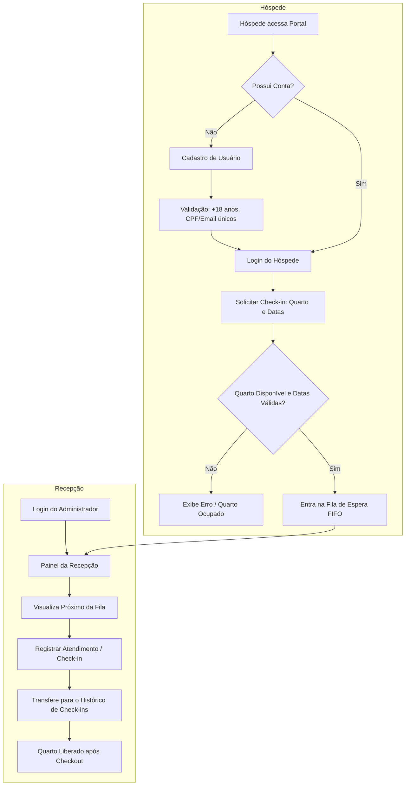

# 🏨 Hotel CheckQ

> **Sistema inteligente de gerenciamento de check-ins e filas de atendimento para hotéis.**

O **Hotel CheckQ** é uma solução completa desenvolvida para modernizar, agilizar e organizar o fluxo de entrada e atendimento de hóspedes em redes hoteleiras e pousadas. O sistema oferece desde o autoatendimento e cadastro do hóspede até o painel operacional em tempo real para a equipe da recepção, com regras robustas de ocupação de quartos, controle de fila FIFO e histórico permanente de atendimentos.

---

## 📌 Índice

- [Visão Geral](#-visão-geral)
- [Funcionalidades Principais](#-funcionalidades-principais)
- [Fluxo de Funcionamento](#-fluxo-de-funcionamento)
- [Arquitetura do Projeto](#-arquitetura-do-projeto)
- [Estrutura de Pastas](#-estrutura-de-pastas)
- [Tecnologias Utilizadas](#-tecnologias-utilizadas)
- [Endpoints da API](#-endpoints-da-api)
- [Regras de Negócio](#-regras-de-negócio)
- [Como Executar o Projeto](#-como-executar-o-projeto)
  - [Pré-requisitos](#pré-requisitos)
  - [1. Clonar o Repositório](#1-clonar-o-repositório)
  - [2. Configurar o Backend](#2-configurar-o-backend)
  - [3. Variáveis de Ambiente](#3-variáveis-de-ambiente)
  - [4. Iniciar o Servidor](#4-iniciar-o-servidor)
  - [5. Acessar o Frontend](#5-acessar-o-frontend)
- [Documentação Interativa (Swagger/OpenAPI)](#-documentação-interativa-swaggeropenapi)
- [Autores e Licença](#-autores-e-licença)

---

## 🌟 Visão Geral

O projeto é dividido em duas frentes integradas:
1. **Área do Hóspede (`checkin-app` e `login-app`)**: Onde os clientes podem se cadastrar (com validação de idade mínima de 18 anos), autenticar-se e solicitar entrada na fila de check-in informando o quarto desejado e os períodos de estadia.
2. **Área da Recepção (`checkin-recepcao`)**: Painel administrativo protegido por credenciais operacionais globais, exibindo a fila de espera com atualização em tempo real, próximo hóspede a ser atendido, liberação de quarto por checkout e histórico consolidado de estadias.

---

## ✨ Funcionalidades Principais

### 👤 Área do Hóspede
- **Cadastro de Usuários**: Registro completo com nome, CPF, e-mail, telefone, data de nascimento e senha com hash criptográfico.
- **Autenticação Segura**: Login com verificação de credenciais e geração de token de sessão temporário (duração de 2 horas).
- **Entrada na Fila de Check-in**: Formulário intuitivo para solicitar entrada na fila informando datas de entrada/saída e número do quarto.
- **Validações Instantâneas**: Alertas interativos com **SweetAlert2** informando erros de digitação, conflito de datas ou quarto já ocupado.

### 🛎️ Área da Recepção & Administração
- **Painel em Tempo Real**: Monitoramento constante da fila de espera com polling automático a cada 5 segundos.
- **Atendimento em Ordem de Chegada (FIFO)**: O primeiro hóspede da fila é destacado com detalhes do quarto, entrada e saída.
- **Ação de Atender Próximo**: Ao concluir o check-in, o hóspede é removido da fila e transferido automaticamente para a tabela de histórico.
- **Checkout / Expiração Automática**: Liberação automática de quartos cujo horário de saída já foi atingido, evitando bloqueios indevidos.
- **Histórico Completo**: Tabela dedicada para auditoria de todos os check-ins concluídos no hotel.
- **Acesso Administrativo Global**: Acesso restrito para recepcionistas e administradores via credenciais pré-configuradas no `.env`.

---

## 🔄 Fluxo de Funcionamento



---

## 🏛 Arquitetura do Projeto

O backend foi arquitetado seguindo o padrão de **Camadas e Separação de Responsabilidades (Layered Architecture)**:

```
FastAPI Router (routes/)
       │
       ▼
Service Layer (services/)       <-- Regras de negócio, validações e exceções
       │
       ▼
Repository Layer (repository/)   <-- Acesso ao banco de dados e queries
       │
       ▼
Domain & ORM (domain/)          <-- Modelos SQLAlchemy e SQLite Engine
```

- **Domain (`domain/`)**: Declaração das tabelas e tipos de dados com SQLAlchemy ORM (`Checkin`, `HistoricoCheckin`, `Usuario`, `UsuarioGlobal`).
- **Repository (`repository/`)**: Encapsula todas as operações de banco de dados (`select`, `insert`, `delete`, `merge`).
- **Services (`services/`)**: Centraliza as regras de negócio, verificações de idade, verificação de duplicidade, cálculo de checkout expirado e controle da fila.
- **Routes (`routes/`)**: Controladores HTTP com FastAPI e validação de contratos com schemas Pydantic.
- **Security (`security/`)**: Hashing e verificação de senhas com algoritmo Bcrypt via Passlib.

---

## 📁 Estrutura de Pastas

```text
hotel-CheckQ/
│
├── backend/
│   ├── data/
│   │   └── checkin.db                 # Banco de dados local SQLite (gerado automaticamente)
│   ├── domain/
│   │   ├── base.py                    # Configuração da engine SQLAlchemy e Base declarativa
│   │   ├── checkin.py                 # Modelo da fila de check-ins ativos
│   │   ├── historico_checkin.py       # Modelo de registros de check-ins finalizados
│   │   ├── usuario.py                 # Modelo de hóspedes cadastrados
│   │   └── usuario_global.py          # Modelo de administrador/recepcionista global
│   ├── repository/
│   │   ├── checkin_repository.py      # Operações no banco para fila e expirações
│   │   ├── historico_chekin_repository.py # Consultas ao histórico de check-ins
│   │   ├── usuario_repository.py      # CRUD de usuários hóspedes
│   │   └── usuario_global_repository.py # Persistência do usuário administrativo
│   ├── routes/
│   │   ├── auth_routes.py             # Rotas de login (/auth/login e /admin/login)
│   │   ├── checkin_routes.py          # Rotas da fila de check-in (/fila)
│   │   ├── historico_chekin_routes.py # Rota de histórico (/historico)
│   │   ├── usuario_global_routes.py   # Rota de verificação do admin (/admin/user)
│   │   └── usuarios_routes.py         # CRUD de hóspedes (/usuarios)
│   ├── security/
│   │   └── senha.py                   # Criptografia de senhas com passlib e bcrypt
│   ├── services/
│   │   ├── auth_service.py            # Regras de autenticação e tokens
│   │   ├── checkin_service.py         # Regras da fila, quartos e validações de datas
│   │   ├── historico_chekin_service.py# Lógica do histórico
│   │   ├── usuario_service.py         # Regras de cadastro, idade mínima e busca
│   │   └── usuario_global_service.py  # Inicialização do admin padrão via .env
│   └── main.py                        # Ponto de entrada FastAPI, CORS e Lifespan
│
├── frontend/
│   ├── checkin-app/                   # Interface do Hóspede
│   │   ├── index.html                 # Tela de boas-vindas e formulário de check-in
│   │   ├── script.js                  # Lógica de envio e integração com /fila
│   │   └── style.css                  # Estilos modernos da tela do hóspede
│   │
│   ├── checkin-recepcao/              # Interface da Recepção
│   │   ├── checkin_recepcao.html      # Painel da fila em tempo real
│   │   ├── script.js                  # Polling da fila e atendimento do próximo
│   │   ├── historico.html             # Tela do histórico de check-ins
│   │   ├── historico.js               # Busca e renderização da tabela de histórico
│   │   └── style.css                  # Estilos da recepção e tabelas
│   │
│   └── login-app/                     # Telas de Autenticação e Acesso
│       ├── login.html                 # Login geral/hóspede
│       ├── login_admin.html           # Login específico para equipe da recepção
│       ├── cadastro.html              # Tela de cadastro de novos hóspedes
│       ├── admin.js                   # Integração do login administrativo
│       ├── cadastro.js                # Validações e envio de cadastro
│       ├── script.js                  # Gerenciador de login de hóspedes
│       └── style.css                  # Estilos visuais compartilhados de autenticação
│
├── .env                               # Variáveis de ambiente locais (não versionar dados sensíveis)
├── .gitignore                         # Arquivos ignorados pelo Git
├── requirements.txt                   # Dependências do Python
└── README.md                          # Documentação completa do projeto
```

---

## 🛠 Tecnologias Utilizadas

### Backend
- **Python 3.10+ / 3.14**
- **[FastAPI](https://fastapi.tiangolo.com/)**: Framework assíncrono de alta performance para construção da API REST.
- **[Uvicorn](https://www.uvicorn.org/)**: Servidor ASGI rápido para rodar a aplicação.
- **[SQLAlchemy 2.0](https://www.sqlalchemy.org/)**: ORM para mapeamento objeto-relacional e gerenciamento do banco.
- **[SQLite](https://www.sqlite.org/)**: Banco de dados relacional leve e embutido.
- **[Pydantic v2](https://docs.pydantic.dev/)**: Validação e serialização de dados com tipagem estrita.
- **[Passlib & Bcrypt](https://passlib.readthedocs.io/)**: Hashing e verificação de senhas seguras.
- **[python-dotenv](https://github.com/theskumar/python-dotenv)**: Carregamento de variáveis de ambiente do arquivo `.env`.

### Frontend
- **HTML5 Semântico**: Estruturação acessível e clara das páginas.
- **CSS3 Moderno**: Layout responsivo, Flexbox, Grid e variáveis CSS personalizadas.
- **JavaScript (ES6+)**: Consumo assíncrono de APIs REST via `fetch`, manipulação de DOM e `localStorage`.
- **[SweetAlert2](https://sweetalert2.github.io/)**: Modais e popups interativos de notificação, sucesso e erro.
- **[Anime.js](https://animejs.com/)**: Biblioteca leve para animações visuais fluidas.

---

## 🔌 Endpoints da API

Abaixo estão listados os principais endpoints disponibilizados pela API:

### 1. Fila de Check-in (`/fila`)
| Método | Endpoint | Descrição | Status Sucesso |
| :--- | :--- | :--- | :--- |
| `POST` | `/fila` | Solicita inclusão na fila de check-in | `200 OK` |
| `GET` | `/fila` | Retorna todos os hóspedes aguardando atendimento na fila | `200 OK` |
| `DELETE` | `/fila/proximo` | Atende o próximo hóspede da fila e o move para o histórico | `200 OK` |

#### Payload de Exemplo - `POST /fila`:
```json
{
  "nome_hospede": "Maria Silva",
  "numero_quarto": 102,
  "horario_entrada": "2026-10-01T14:00:00",
  "horario_saida": "2026-10-05T12:00:00"
}
```

---

### 2. Histórico (`/historico`)
| Método | Endpoint | Descrição | Status Sucesso |
| :--- | :--- | :--- | :--- |
| `GET` | `/historico` | Retorna o registro completo de check-ins já atendidos | `200 OK` |

---

### 3. Gestão de Usuários (`/usuarios`)
| Método | Endpoint | Descrição | Status Sucesso |
| :--- | :--- | :--- | :--- |
| `GET` | `/usuarios` | Lista todos os usuários hóspedes cadastrados | `200 OK` |
| `POST` | `/usuarios` | Cadastra um novo hóspede (idade mínima 18 anos) | `200 OK` |
| `GET` | `/usuarios/{usuario_id}` | Obtém os dados de um hóspede específico | `200 OK` |
| `DELETE` | `/usuarios/{usuario_id}`| Remove o cadastro de um hóspede | `200 OK` |

#### Payload de Exemplo - `POST /usuarios`:
```json
{
  "nome": "João Pereira",
  "cpf": "123.456.789-00",
  "email": "joao@email.com",
  "senha": "senhaSegura123",
  "telefone": "(11) 98765-4321",
  "data_nascimento": "1998-05-20T00:00:00"
}
```

---

### 4. Autenticação (`/auth` e `/admin`)
| Método | Endpoint | Descrição | Status Sucesso |
| :--- | :--- | :--- | :--- |
| `POST` | `/auth/login` | Realiza login do hóspede e retorna token de sessão | `200 OK` |
| `POST` | `/admin/login` | Realiza login do usuário administrador/recepção | `200 OK` |
| `GET` | `/admin/user` | Verifica se o administrador global foi provisionado | `200 OK` |

---

## 📋 Regras de Negócio

1. **Capacidade de Quartos**: O hotel possui quartos numerados entre **1 e 100**. Números fora dessa faixa são rejeitados (`NumeroQuartoInvalidoError`).
2. **Quarto Já Ocupado**: Dois hóspedes não podem ocupar o mesmo quarto ao mesmo tempo (`QuartoJaOcupadoError` com status HTTP 409).
3. **Consistência de Datas**:
   - A data de check-in não pode ser no passado.
   - A data de check-out deve ser obrigatoriamente posterior à de check-in.
4. **Checkout Automático**: Ao listar ou solicitar um novo check-in, o sistema verifica automaticamente check-ins com horário de saída expirado, registrando-os no histórico e liberando os quartos.
5. **Idade Mínima**: Apenas maiores de 18 anos podem se cadastrar no sistema como hóspedes (`MenorDeIdadeError`).
6. **Unicidade de Dados**: Não é permitido duplicar CPF ou endereço de e-mail no cadastro (`UsuarioJaExisteError`).
7. **Admin Global Automático**: No startup da aplicação FastAPI (`lifespan`), as credenciais definidas no arquivo `.env` geram automaticamente a conta administradora se ela ainda não existir no banco de dados.

---

## 🚀 Como Executar o Projeto

### Pré-requisitos
- **Python** (versão 3.10 ou superior instalada).
- **Pip** (gerenciador de pacotes Python).
- Navegador web moderno (Chrome, Edge, Firefox, Brave).
- Opcional: Extensão **Live Server** no VS Code para servir os arquivos frontend.

---

### 1. Clonar o Repositório
```bash
git clone https://github.com/jcdev01/hotel-CheckQ.git
cd hotel-CheckQ
```

---

### 2. Configurar o Backend
Crie e ative um ambiente virtual (recomendado):

**No Windows (PowerShell):**
```powershell
python -m venv venv
.\venv\Scripts\Activate.ps1
```

**No Linux / macOS:**
```bash
python3 -m venv venv
source venv/bin/activate
```

Instale todas as dependências do projeto:
```bash
pip install -r requirements.txt
```

---

### 3. Variáveis de Ambiente
Crie um arquivo `.env` na raiz do projeto (mesma pasta onde está o `README.md`) com as seguintes configurações:

```env
ADMIN_USERNAME=admin
ADMIN_PASSWORD=admin123
```

> 💡 **Nota**: O usuário e senha configurados acima serão utilizados para acessar a área administrativa da recepção (`login_admin.html`).

---

### 4. Iniciar o Servidor FastAPI
Navegue até a pasta `backend` e execute o servidor Uvicorn:

```bash
cd backend
uvicorn main:app --reload
```

O servidor iniciará por padrão em: **`http://127.0.0.1:8000`**

---

### 5. Acessar o Frontend
Você pode abrir os arquivos HTML diretamente no navegador ou utilizar um servidor local (ex.: extensão **Live Server** no VS Code):

- **Login e Cadastro de Hóspedes**:  
  Abra `frontend/login-app/login.html` ou `cadastro.html`
- **Área do Hóspede (Solicitar Check-in)**:  
  Abra `frontend/checkin-app/index.html`
- **Acesso Administrativo (Recepção)**:  
  Abra `frontend/login-app/login_admin.html`
- **Painel de Atendimento da Recepção**:  
  Abra `frontend/checkin-recepcao/checkin_recepcao.html`
- **Histórico de Atendimentos**:  
  Abra `frontend/checkin-recepcao/historico.html`

---

## 📖 Documentação Interativa (Swagger/OpenAPI)

Com o backend em execução, acesse a documentação interativa gerada automaticamente pelo FastAPI:

- **Swagger UI**: [http://127.0.0.1:8000/docs](http://127.0.0.1:8000/docs)
- **ReDoc**: [http://127.0.0.1:8000/redoc](http://127.0.0.1:8000/redoc)

Pela interface do Swagger você pode testar diretamente todas as rotas e payloads em tempo real.

---

## 👨‍💻 Autores e Contribuição

Projeto desenvolvido como solução integrada de check-in hoteleiro.  
Contribuições, sugestões de melhorias e abertura de *issues* ou *pull requests* são muito bem-vindas!

---

*Hotel CheckQ — Gerenciamento hoteleiro ágil, simples e moderno.* 🏨✨
# hotel-CheckQ