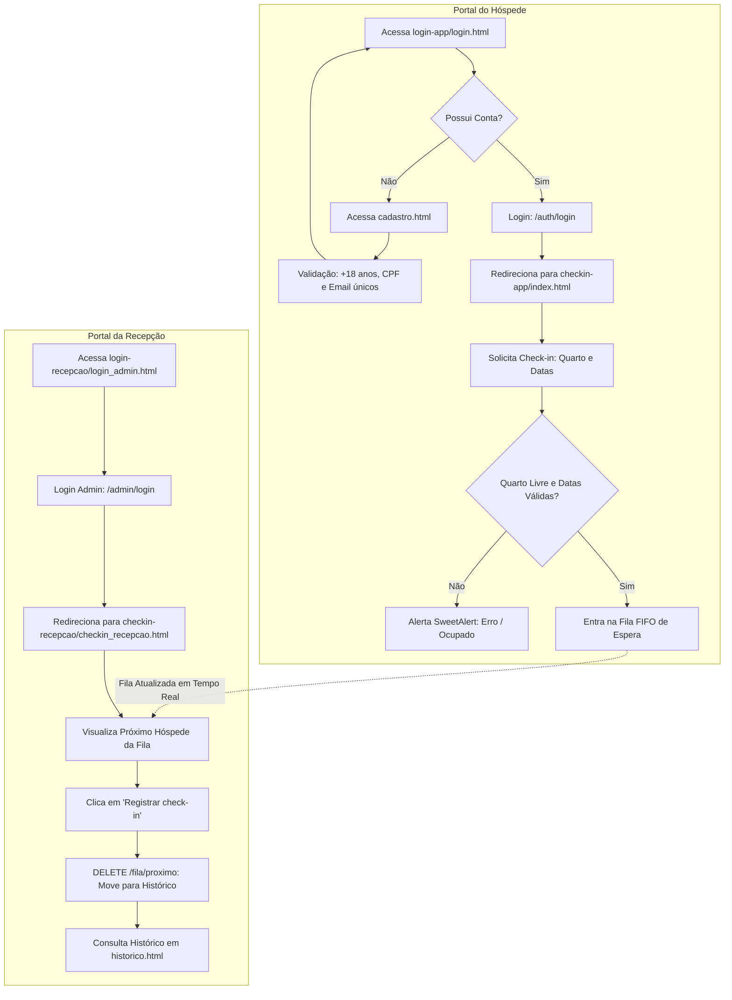

# 🏨 Hotel CheckQ

> **Sistema inteligente de gerenciamento de check-ins e filas de atendimento para hotéis.**

> [!IMPORTANT]
> 🎓 **Projeto Estritamente Acadêmico**: Este software foi desenvolvido exclusivamente para fins didáticos, educacionais e avaliativos. **Ele não foi projetado para ambientes comerciais e NÃO entrará em produção.**

O **Hotel CheckQ** é uma solução acadêmica desenvolvida para simular, modernizar e organizar o fluxo de entrada e atendimento de hóspedes em redes hoteleiras. O sistema oferece fluxos segregados para autoatendimento do hóspede e operação da recepção, contando com controle de fila FIFO em tempo real, validação de ocupação de quartos, expiração automática de diárias, histórico permanente e autenticação segura com bcrypt.

---

## 📌 Índice

- [Aviso Acadêmico](#-aviso-acadêmico)
- [Visão Geral](#-visão-geral)
- [Funcionalidades Principais](#-funcionalidades-principais)
- [Fluxo de Funcionamento](#-fluxo-de-funcionamento)
- [Arquitetura do Projeto](#-arquitetura-do-projeto)
- [Estrutura de Pastas](#-estrutura-de-pastas)
- [Tecnologias Utilizadas](#-tecnologias-utilizadas)
- [Endpoints da API](#-endpoints-da-api)
- [Regras de Negócio](#-regras-de-negócio)
- [Como Executar o Projeto](#-como-executar-o-projeto)
  - [Pré-requisitos](#pré-requisitos)
  - [1. Clonar o Repositório](#1-clonar-o-repositório)
  - [2. Configurar o Backend](#2-configurar-o-backend)
  - [3. Variáveis de Ambiente](#3-variáveis-de-ambiente)
  - [4. Iniciar o Servidor](#4-iniciar-o-servidor)
  - [5. Acessar o Frontend](#5-acessar-o-frontend)
- [Documentação Interativa (Swagger/OpenAPI)](#-documentação-interativa-swaggeropenapi)
- [Propósito e Natureza do Projeto](#-propósito-e-natureza-do-projeto)

---

## � Aviso Acadêmico

Este software foi concebido como um trabalho prático de disciplina universitária com o propósito de exercitar conceitos fundamentais da engenharia de software e desenvolvimento fullstack.

- **Não entrará em produção:** Trata-se de um protótipo de testes e aprendizado.
- **Segurança e Conformidade:** Não possui certificações de segurança comercial, homologação para conformidade com a LGPD/GDPR nem infraestrutura para transações financeiras reais.

---

## �🌟 Visão Geral

O projeto é dividido em **duas jornadas independentes e integradas**:

1. **Jornada do Hóspede**:
   - **Portal de Acesso (`frontend/login-app/`)**: Permite que novos hóspedes se cadastrem (com validação de idade mínima de 18 anos) e realizem login.
   - **Portal do Hóspede (`frontend/checkin-app/`)**: Ambiente do hóspede logado para solicitar entrada na fila informando o quarto e período de estadia, além de botão para logout seguro.

2. **Jornada da Recepção & Administração**:
   - **Portal Administrativo (`frontend/login-recepcao/`)**: Tela exclusiva para a equipe da recepção se autenticar utilizando as credenciais do usuário global configurado no `.env`.
   - **Painel Operacional (`frontend/checkin-recepcao/`)**: Interface em tempo real que monitora a fila de espera (polling a cada 5s), destaca o próximo da fila para atendimento/check-in, e disponibiliza o histórico consolidado de atendimentos.

---

## ✨ Funcionalidades Principais

### 👤 Área do Hóspede (`login-app` & `checkin-app`)
- **Cadastro Completo**: Validações de nome, CPF, e-mail, telefone, data de nascimento e senha criptografada.
- **Autenticação Segura**: Geração de tokens de sessão temporários (2 horas de validade) via endpoint `/auth/login`.
- **Solicitação de Check-in**: Inclusão na fila informando o quarto desejado e datas/horários de entrada e saída.
- **Validações com SweetAlert2**: Feedbacks visuais modernos para carregamento (`Swal.showLoading()`), sucesso, erros de conexão e quarto ocupado.
- **Logout Seguro**: Modal de confirmação antes de deslogar e limpar o `localStorage`.

### 🛎️ Área da Recepção (`login-recepcao` & `checkin-recepcao`)
- **Acesso Administrativo Dedicado**: Autenticação restrita via `/admin/login`, isolada do portal dos hóspedes.
- **Fila em Tempo Real**: Atualização automática a cada 5 segundos exibindo contador de hóspedes na fila.
- **Atendimento FIFO (First-In, First-Out)**: Destaque do próximo hóspede com nome, quarto, datas de estadia e avatar dinâmico.
- **Atender Próximo**: Ao clicar em "Registrar check-in", o hóspede é removido da fila ativa e registrado automaticamente no histórico.
- **Expiração Automática de Estadias**: Liberação automática de quartos cujo horário de saída já foi ultrapassado.
- **Histórico Completo**: Visualização em tabela de todos os check-ins finalizados com navegação direta de volta para a fila.

---

## 🔄 Fluxo de Funcionamento



---

## 🏛 Arquitetura do Projeto

O backend adota o padrão em **Camadas (Layered Architecture)**, garantindo desacoplamento, testabilidade e manutenibilidade:

```
FastAPI Router (routes/)
       │
       ▼
Service Layer (services/)        <-- Regras de negócio, validações e cálculo de expiração
       │
       ▼
Repository Layer (repository/)    <-- Acesso ao banco de dados, queries e transações
       │
       ▼
Domain & ORM (domain/)           <-- Modelos SQLAlchemy e SQLite Engine
```

- **Domain (`domain/`)**: Entidades e mapeamentos relacionais (`Checkin`, `HistoricoCheckin`, `Usuario`, `UsuarioGlobal`, `Base`).
- **Repository (`repository/`)**: Métodos de persistência e isolamento do SQLAlchemy (`CheckinRepository`, `HistoricoCheckinRepository`, `UsuarioRepository`, `UsuarioGlobalRepository`).
- **Services (`services/`)**: Regras de negócio como verificação de ocupação, limite de quartos, cálculo de idade, hashing de senha e expiração automática.
- **Routes (`routes/`)**: Endpoints HTTP com validação de schemas Pydantic e tratamento de exceções de domínio.
- **Security (`security/`)**: Funções de hash e verificação de senhas baseadas em **Bcrypt** via Passlib.
- **Lifespan (`main.py`)**: Inicialização assíncrona do FastAPI que assegura a criação do usuário administrador global padrão com base nas variáveis do arquivo `.env`.

---

## 📁 Estrutura de Pastas

```text
hotel-CheckQ/
│
├── backend/
│   ├── data/
│   │   └── checkin.db                 # Banco de dados local SQLite (gerado automaticamente)
│   ├── domain/
│   │   ├── base.py                    # Engine do SQLAlchemy e classe Base declarativa
│   │   ├── checkin.py                 # Modelo da fila de check-ins ativos
│   │   ├── historico_checkin.py       # Modelo de registros de check-ins finalizados
│   │   ├── usuario.py                 # Modelo de hóspedes cadastrados
│   │   └── usuario_global.py          # Modelo de administrador da recepção
│   ├── repository/
│   │   ├── checkin_repository.py      # Persistência da fila, atendimento e checkout
│   │   ├── historico_chekin_repository.py # Consultas ao histórico de atendimentos
│   │   ├── usuario_repository.py      # CRUD de hóspedes no banco
│   │   └── usuario_global_repository.py # Persistência do usuário administrativo
│   ├── routes/
│   │   ├── auth_routes.py             # Login de hóspedes (/auth/login) e admin (/admin/login)
│   │   ├── checkin_routes.py          # Gerenciamento da fila (/fila e /fila/proximo)
│   │   ├── historico_chekin_routes.py # Consulta ao histórico (/historico)
│   │   ├── usuario_global_routes.py   # Verificação do admin (/admin/user)
│   │   └── usuarios_routes.py         # Cadastro e listagem de hóspedes (/usuarios)
│   ├── security/
│   │   └── senha.py                   # Criptografia de senhas com bcrypt
│   ├── services/
│   │   ├── auth_service.py            # Validação de credenciais e tokens de sessão
│   │   ├── checkin_service.py         # Regras de quartos, validação de datas e fila
│   │   ├── historico_chekin_service.py# Lógica do histórico de atendimentos
│   │   ├── usuario_service.py         # Regras de cadastro, idade mínima e busca
│   │   └── usuario_global_service.py  # Provisionamento automático do admin via .env
│   └── main.py                        # Instância do FastAPI, CORS e Lifespan
│
├── frontend/
│   ├── login-app/                     # [Hóspede] Portal de Autenticação e Cadastro
│   │   ├── login.html                 # Tela de login do hóspede
│   │   ├── cadastro.html              # Tela de cadastro de novos hóspedes
│   │   ├── script.js                  # Integração de login do hóspede com /auth/login
│   │   ├── cadastro.js                # Validações e envio do cadastro para /usuarios
│   │   └── style.css                  # Estilos visuais do portal do hóspede
│   │
│   ├── login-recepcao/                # [Recepção] Portal de Acesso Administrativo
│   │   ├── login_admin.html           # Tela de login da equipe da recepção
│   │   ├── admin.js                   # Integração do login administrativo com /admin/login
│   │   └── style.css                  # Estilos dedicados ao login administrativo
│   │
│   ├── checkin-app/                   # [Hóspede] Painel de Solicitação de Check-in
│   │   ├── index.html                 # Boas-vindas, formulário de check-in e logout
│   │   ├── script.js                  # Submissão de check-in e alertas SweetAlert2
│   │   └── style.css                  # Estilos do autoatendimento do hóspede
│   │
│   └── checkin-recepcao/              # [Recepção] Painel Operacional e Histórico
│       ├── checkin_recepcao.html      # Painel da fila em tempo real e atendimento
│       ├── script.js                  # Polling da fila (5s) e atendimento de hóspedes
│       ├── historico.html             # Tabela de check-ins já concluídos
│       ├── historico.js               # Carregamento assíncrono do histórico
│       └── style.css                  # Estilos do painel operacional
│
├── .env                               # Variáveis de ambiente locais (não versionar)
├── .gitignore                         # Configuração de arquivos ignorados pelo Git
├── requirements.txt                   # Dependências do ecossistema Python
└── README.md                          # Documentação técnica e acadêmica do projeto
```

---

## 🛠 Tecnologias Utilizadas

### Backend
- **Python 3.10+ / 3.14**
- **[FastAPI](https://fastapi.tiangolo.com/)**: Framework web moderno, assíncrono e de alto desempenho.
- **[Uvicorn](https://www.uvicorn.org/)**: Servidor ASGI leve e veloz.
- **[SQLAlchemy 2.0](https://www.sqlalchemy.org/)**: ORM declarativo com suporte a tipos e sessões gerenciadas.
- **[SQLite](https://www.sqlite.org/)**: Banco de dados relacional embutido em arquivo (`data/checkin.db`).
- **[Pydantic v2](https://docs.pydantic.dev/)**: Validação e serialização de dados via schemas tipados.
- **[Passlib & Bcrypt](https://passlib.readthedocs.io/)**: Hashing unidirecional e verificação segura de senhas.
- **[python-dotenv](https://github.com/theskumar/python-dotenv)**: Gerenciamento seguro de configurações via arquivo `.env`.

### Frontend
- **HTML5 Semântico**: Estrutura acessível e semântica.
- **CSS3 Moderno**: Custom Properties (variáveis CSS), Flexbox e CSS Grid responsivo.
- **JavaScript Vanilla (ES6+)**: Funções assíncronas (`async/await`), Fetch API, manipulação dinâmica do DOM e persistência em `localStorage`.
- **[SweetAlert2](https://sweetalert2.github.io/)**: Biblioteca para popups, modais de confirmação e alertas de carregamento interativos.

---

## 🔌 Endpoints da API

### 1. Fila de Check-in (`/fila`)
| Método | Rota | Descrição | Status de Sucesso |
| :--- | :--- | :--- | :--- |
| `POST` | `/fila` | Solicita inclusão na fila de check-in | `200 OK` |
| `GET` | `/fila` | Retorna todos os hóspedes aguardando atendimento | `200 OK` |
| `DELETE` | `/fila/proximo` | Atende o próximo hóspede da fila e o move para o histórico | `200 OK` |

#### Payload de Exemplo - `POST /fila`:
```json
{
  "nome_hospede": "Maria Silva",
  "numero_quarto": 102,
  "horario_entrada": "2026-10-01T14:00:00",
  "horario_saida": "2026-10-05T12:00:00"
}
```

---

### 2. Histórico de Atendimentos (`/historico`)
| Método | Rota | Descrição | Status de Sucesso |
| :--- | :--- | :--- | :--- |
| `GET` | `/historico` | Retorna todos os registros de check-ins já atendidos | `200 OK` |

---

### 3. Gestão de Hóspedes (`/usuarios`)
| Método | Rota | Descrição | Status de Sucesso |
| :--- | :--- | :--- | :--- |
| `GET` | `/usuarios` | Lista todos os usuários cadastrados | `200 OK` |
| `POST` | `/usuarios` | Cadastra um novo hóspede (valida idade mínima de 18 anos) | `200 OK` |
| `GET` | `/usuarios/{usuario_id}` | Obtém dados de um hóspede específico | `200 OK` |
| `DELETE` | `/usuarios/{usuario_id}`| Remove o cadastro de um hóspede | `200 OK` |

#### Payload de Exemplo - `POST /usuarios`:
```json
{
  "nome": "Carlos Drummond",
  "cpf": "111.222.333-44",
  "email": "carlos@email.com",
  "senha": "senhaSegura123",
  "telefone": "(11) 99999-8888",
  "data_nascimento": "1995-03-15T00:00:00"
}
```

---

### 4. Autenticação e Acesso (`/auth` e `/admin`)
| Método | Rota | Descrição | Status de Sucesso |
| :--- | :--- | :--- | :--- |
| `POST` | `/auth/login` | Autentica o hóspede e retorna token de sessão | `200 OK` |
| `POST` | `/admin/login` | Autentica o usuário da recepção / administrador | `200 OK` |
| `GET` | `/admin/user` | Verifica se o administrador global foi provisionado | `200 OK` |

---

## 📋 Regras de Negócio

1. **Faixa Válida de Quartos**: O hotel possui quartos numerados de **1 a 100**. Números fora deste intervalo disparam `NumeroQuartoInvalidoError` (HTTP 400).
2. **Quarto Já Ocupado**: Impede que dois check-ins simultâneos ocupem o mesmo quarto (`QuartoJaOcupadoError` — HTTP 409).
3. **Consistência Cronológica**:
   - A data de check-in não pode estar no passado.
   - A data de saída deve ser estritamente posterior à de entrada.
4. **Checkout Automático**: Sempre que a fila é consultada ou alterada, check-ins com horário de saída ultrapassado são arquivados no histórico e o quarto é desocupado automaticamente.
5. **Maioridade Obrigatória**: O cliente deve ter no mínimo 18 anos completos no momento do cadastro (`MenorDeIdadeError` — HTTP 400).
6. **Unicidade Cadastral**: Não é permitido cadastrar CPFs ou e-mails já existentes no banco (`UsuarioJaExisteError` — HTTP 400).
7. **Criação do Admin no Startup**: No evento `lifespan` do FastAPI, se o usuário administrativo global não existir no banco, ele é criado automaticamente a partir das credenciais do `.env`.

---

## 🚀 Como Executar o Projeto

### Pré-requisitos
- **Python** (versão 3.10 ou superior instalada).
- **Pip** (gerenciador de pacotes do Python).
- Navegador web moderno (Chrome, Firefox, Edge, Brave).
- Recomendado: Extensão **Live Server** no VS Code para servir os módulos frontend.

---

### 1. Clonar o Repositório
```bash
git clone https://github.com/jcdev01/hotel-CheckQ.git
cd hotel-CheckQ
```

---

### 2. Configurar o Backend
Crie e ative um ambiente virtual:

**No Windows (PowerShell):**
```powershell
python -m venv venv
.\venv\Scripts\Activate.ps1
```

**No Linux / macOS:**
```bash
python3 -m venv venv
source venv/bin/activate
```

Instale as dependências:
```bash
pip install -r requirements.txt
```

---

### 3. Variáveis de Ambiente
Crie um arquivo `.env` na raiz do projeto (mesma pasta deste `README.md`) definindo o usuário e a senha da recepção:

```env
ADMIN_USERNAME=admin
ADMIN_PASSWORD=admin123
```

---

### 4. Iniciar o Servidor FastAPI
Entre na pasta `backend` e inicialize o servidor com recarregamento automático:

```bash
cd backend
uvicorn main:app --reload
```

A API estará acessível em: **`http://127.0.0.1:8000`**

---

### 5. Acessar o Frontend
Você pode utilizar a extensão **Live Server** do VS Code ou abrir os arquivos `.html` diretamente no navegador:

| Módulo | Arquivo Principal | Descrição |
| :--- | :--- | :--- |
| **Portal do Hóspede** | `frontend/login-app/login.html` | Login dos hóspedes |
| **Cadastro de Hóspedes** | `frontend/login-app/cadastro.html` | Registro de novos clientes |
| **Painel do Hóspede** | `frontend/checkin-app/index.html` | Solicitação de check-in e entrada na fila |
| **Login da Recepção** | `frontend/login-recepcao/login_admin.html` | Acesso exclusivo da equipe do hotel |
| **Painel da Recepção** | `frontend/checkin-recepcao/checkin_recepcao.html`| Fila em tempo real e atendimento |
| **Histórico** | `frontend/checkin-recepcao/historico.html` | Relatório de check-ins já concluídos |

---

## 📖 Documentação Interativa (Swagger/OpenAPI)

Com o servidor rodando, acesse a documentação interativa gerada pelo FastAPI para testar todos os endpoints diretamente no navegador:

- **Swagger UI**: [http://127.0.0.1:8000/docs](http://127.0.0.1:8000/docs)
- **ReDoc**: [http://127.0.0.1:8000/redoc](http://127.0.0.1:8000/redoc)

---

## 👨‍💻 Propósito e Natureza do Projeto

Este projeto possui caráter **estritamente acadêmico**, desenvolvido no âmbito de estudos universitários/cursos de tecnologia com o objetivo de exercitar e consolidar conceitos fundamentais de desenvolvimento de software:

- **Arquitetura em Camadas (Layered Architecture)** com separação estrita de Domínio, Repositório, Serviço e Rotas.
- **APIs RESTful assíncronas** de alta performance com **FastAPI**.
- **Mapeamento Objeto-Relacional (ORM)** e controle de sessões transacionais com **SQLAlchemy 2.0**.
- **Validação de tipos e contratos** de dados com **Pydantic**.
- **Autenticação e Criptografia** com hashing seguro via **Bcrypt**.
- **Segregação de interfaces e experiência do usuário (UX)** com JavaScript Vanilla e **SweetAlert2**.

> ⚠️ **Aviso de Não-Produção**: Este sistema foi desenvolvido como material didático e simulador de fluxo hoteleiro. Não possui suporte comercial, garantias de SLA, alta disponibilidade distribuída, nem auditoria para conformidade legal (LGPD). **Não deve ser utilizado em ambientes de produção.**

---

*Hotel CheckQ — Projeto Acadêmico de Gestão Hoteleira.* 🏨🎓
# hotel-CheckQ